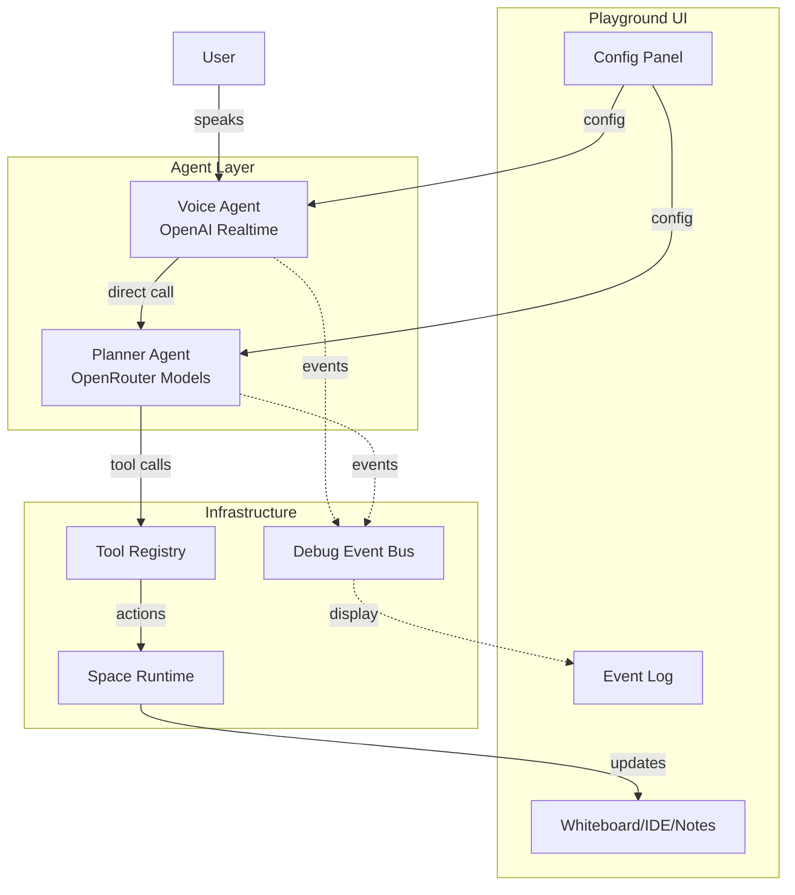

# AI Tutor Playground Plan

## Architecture Overview



## Key Design Decisions

- **Voice Agent**: Stays on OpenAI Realtime (current `session.ts`), focuses on conversation only
- **Planner Agent**: New agent using AI SDK + OpenRouter, handles all tool execution
- **Communication**: Voice agent directly calls planner (low latency), debug events for UI
- **Model Switching**: OpenRouter integration allows testing Gemini Flash, Claude, GPT-4o-mini, etc.

## Folder Structure

```
app/test-app/
├── page.tsx                    # Main playground page (existing, will update)
├── agents/
│   ├── voice/
│   │   ├── session.ts          # OpenAI Realtime session (move from agent/)
│   │   └── config.ts           # Voice agent configuration
│   ├── planner/
│   │   ├── agent.ts            # AI SDK planner agent
│   │   ├── prompts.ts          # Planner system prompts
│   │   └── router.ts           # Routes intents to tools
│   └── types.ts                # Shared agent types
├── tools/                      # Tool definitions (existing, will reorganize)
│   ├── whiteboard.ts
│   ├── ide.ts
│   ├── notes.ts
│   └── registry.ts
├── lib/
│   ├── openrouter.ts           # OpenRouter client setup
│   ├── eventBus.ts             # Debug event bus for UI
│   └── runtime.ts              # Space runtime (existing)
├── components/
│   ├── PlaygroundControls.tsx  # Architecture/model/prompt config
│   ├── EventLogPanel.tsx       # Real-time event visualization
│   ├── AIVoiceAgentPanel.tsx   # Voice controls (existing, will update)
│   └── ...existing components
├── hooks/
│   └── usePlayground.ts        # Central state management
└── types/
    └── playground.ts           # Playground-specific types
```

## Implementation Details

### 1. OpenRouter Integration ([`app/test-app/lib/openrouter.ts`](app/test-app/lib/openrouter.ts))

Use AI SDK with OpenRouter as the provider:

```typescript
import { createOpenAI } from "@ai-sdk/openai";

export const openrouter = createOpenAI({
  baseURL: "https://openrouter.ai/api/v1",
  apiKey: process.env.NEXT_PUBLIC_OPENROUTER_API_KEY,
});

// Usage: openrouter("google/gemini-2.0-flash-exp")
```

### 2. Planner Agent ([`app/test-app/agents/planner/agent.ts`](app/test-app/agents/planner/agent.ts))

AI SDK-based agent that receives intents from voice agent:

```typescript
import { generateText } from "ai";
import { openrouter } from "../../lib/openrouter";

export async function runPlanner(params: {
  intent: string;
  context: SpaceContext;
  model: string;  // e.g. "google/gemini-2.0-flash-exp"
  tools: ToolSet;
  eventBus: EventBus;
}) {
  eventBus.emit("planner:start", { intent, model });
  
  const result = await generateText({
    model: openrouter(params.model),
    system: buildPlannerPrompt(params.context),
    prompt: params.intent,
    tools: params.tools,
    maxSteps: 10,
  });
  
  eventBus.emit("planner:done", { result });
  return result;
}
```

### 3. Voice-to-Planner Bridge

When user stops speaking, voice agent extracts intent and calls planner:

```typescript
// In voice agent event handler
if (evt.type === "input_audio_buffer.speech_stopped") {
  // Get transcript from voice agent
  const transcript = await getTranscript();
  
  // Direct call to planner (fast path)
  const result = await runPlanner({
    intent: transcript,
    context: gatherSpaceContext(),
    model: selectedModel,  // from UI controls
    tools: buildAllTools(runtime),
    eventBus,
  });
  
  // Voice agent speaks the response
  speakResponse(result.text);
}
```

### 4. Debug Event Bus ([`app/test-app/lib/eventBus.ts`](app/test-app/lib/eventBus.ts))

Simple typed event emitter for playground observability:

```typescript
type PlaygroundEvents = {
  "voice:speech_start": { ts: number };
  "voice:speech_end": { ts: number; transcript: string };
  "planner:start": { intent: string; model: string };
  "planner:tool_call": { name: string; args: unknown };
  "planner:done": { result: unknown; durationMs: number };
  "tool:execute": { name: string; args: unknown };
  "tool:result": { name: string; result: unknown };
};
```

### 5. Playground Controls UI ([`app/test-app/components/PlaygroundControls.tsx`](app/test-app/components/PlaygroundControls.tsx))

Config panel for testing different setups:

- **Architecture selector**: realtime_tools | split_planner | specialists (future)
- **Model dropdown**: List of OpenRouter models (gemini-flash, gpt-4o-mini, claude-3-haiku, etc.)
- **Prompt editor**: Edit planner system prompt in real-time
- **Feature toggles**: Enable/disable auto-context, image context, etc.

### 6. Event Log Panel ([`app/test-app/components/EventLogPanel.tsx`](app/test-app/components/EventLogPanel.tsx))

Real-time visualization of the agent pipeline:

- Timeline view of all events
- Expandable details for each event
- Filter by event type
- Export session as JSON

## API Route for Planner ([`app/api/playground/planner/route.ts`](app/api/playground/planner/route.ts))

Server-side route to keep API keys secure:

```typescript
export async function POST(req: Request) {
  const { intent, context, model, systemPrompt } = await req.json();
  
  const result = await generateText({
    model: openrouter(model),
    system: systemPrompt,
    messages: [{ role: "user", content: intent }],
    tools: getToolDefinitions(), // Tool schemas only
  });
  
  return Response.json(result);
}
```

## External Dependencies

- **Convex**: Only uses existing [`convex/realtime.ts`](convex/realtime.ts) for OpenAI Realtime token
- **OpenRouter**: New - requires `OPENROUTER_API_KEY` env variable
- **AI SDK**: Already installed (ai v5.0.113)

## Migration from Current Code

- Move `agent/session.ts` to `agents/voice/session.ts`
- Keep existing tools, wrap them for AI SDK format
- Existing UI components stay, add new control panels
- `page.tsx` gets refactored to use new `usePlayground` hook