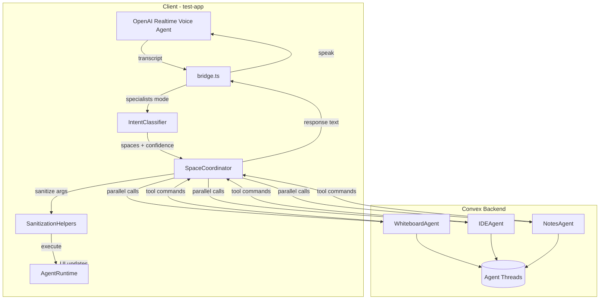

# Specialists Architecture for test-app Playground

## Overview

The `app/test-app/` playground supports three architecture modes:

- `realtime_tools` - Voice agent has direct tool access (implemented)
- `split_planner` - Voice agent delegates to a planner agent (implemented)
- `specialists` - Each space has its own agent (this plan)

This plan implements **specialists** mode using **Convex Agents** (`@convex-dev/agent`) with patterns from the **tldraw Agent Starter Kit**:

- **Visual Context System** - Screenshot + structured shape data (BlurryShape, SimpleShape)
- **Action System** - Modular actions with Zod schemas, validation, sanitization
- **Streaming/Multi-turn** - Agents can schedule follow-up work
- **Sanitization** - Ensure shape IDs exist, coordinates are valid, etc.

---

## Architecture Diagram



---

## Part 1: Convex Agent Setup

### 1.1 Install and Configure

```bash
npm install @convex-dev/agent
```

Create `convex/convex.config.ts`:

```ts
import { defineApp } from "convex/server";
import agent from "@convex-dev/agent/convex.config";

const app = defineApp();
app.use(agent);

export default app;
```

Run `npx convex dev` to generate `components.agent`.

### 1.2 Shared Types and Utilities

Create `convex/agents/shared.ts`:

```ts
import { v } from "convex/values";

// Validators for tool commands returned to client
export const vToolCommand = v.object({
  toolName: v.string(),
  args: v.any(),
  requiresApproval: v.optional(v.boolean()),
});

export const vAgentResult = v.object({
  text: v.string(),
  toolCommands: v.array(vToolCommand),
  threadId: v.string(),
  durationMs: v.number(),
  error: v.optional(v.string()),
});

// Space context validators
export const vWhiteboardContext = v.object({
  viewport: v.object({ x: v.number(), y: v.number(), w: v.number(), h: v.number() }),
  blurryShapes: v.array(v.any()), // Simplified shape overview
  simpleShapes: v.optional(v.array(v.any())), // Detailed shapes (for focused work)
  peripheralClusters: v.optional(v.array(v.any())),
  screenshot: v.optional(v.string()), // Base64 data URL
});

export const vIdeContext = v.object({
  files: v.array(v.object({ name: v.string(), language: v.string(), size: v.number() })),
  activeFile: v.optional(v.object({
    name: v.string(),
    language: v.string(),
    content: v.string(),
  })),
});

export const vNotesContext = v.object({
  yaml: v.string(),
  parsedTitle: v.optional(v.string()),
  blockCount: v.optional(v.number()),
});
```

---

## Part 2: Whiteboard Agent (Most Complex)

The whiteboard agent draws heavily from the tldraw Agent Starter Kit patterns.

### 2.1 Context Types (Inspired by tldraw)

```ts
// BlurryShape - Overview of shapes in viewport (agent's "blurry" vision)
interface BlurryShape {
  shapeId: string;
  type: string; // geo, text, draw, arrow, etc.
  bounds: { x: number; y: number; w: number; h: number };
  hasText: boolean;
  textPreview?: string; // First 50 chars
}

// SimpleShape - Detailed shape for focused work
interface SimpleShape {
  shapeId: string;
  type: string;
  x: number;
  y: number;
  w?: number;
  h?: number;
  rotation?: number;
  text?: string;
  note?: string; // Agent's internal notes
  color?: string;
  fill?: string;
  geo?: string;
  // Type-specific props...
}

// PeripheralCluster - Shapes outside viewport
interface PeripheralCluster {
  count: number;
  bounds: { x: number; y: number; w: number; h: number };
  direction: "top" | "bottom" | "left" | "right";
}
```

### 2.2 Agent Definition

Create `convex/agents/whiteboard.ts`:

```ts
import { Agent, createTool, createThread } from "@convex-dev/agent";
import { openai } from "@ai-sdk/openai";
import { z } from "zod/v3";
import { components, internal } from "../_generated/api";
import { action, internalAction } from "../_generated/server";
import { v } from "convex/values";
import { vWhiteboardContext, vAgentResult, vToolCommand } from "./shared";

// ============================================
// TOOL SCHEMAS (following tldraw patterns)
// ============================================

const CreateShapeSchema = z.object({
  _type: z.literal("create_shape"),
  geo: z.enum([
    "rectangle", "ellipse", "triangle", "diamond", "pentagon", 
    "hexagon", "octagon", "star", "rhombus", "cloud", "heart",
    "arrow-right", "arrow-left", "arrow-up", "arrow-down",
    "x-box", "check-box", "trapezoid", "oval"
  ]).describe("Shape geometry type"),
  x: z.number().describe("X position in canvas coordinates"),
  y: z.number().describe("Y position in canvas coordinates"),
  w: z.number().default(100).describe("Width"),
  h: z.number().default(80).describe("Height"),
  color: z.string().default("black").describe("Stroke color"),
  fill: z.enum(["none", "tint", "background", "solid", "pattern"]).default("none"),
}).meta({
  title: "Create Shape",
  description: "Create a geometric shape on the whiteboard.",
});

const CreateTextSchema = z.object({
  _type: z.literal("create_text"),
  x: z.number(),
  y: z.number(),
  text: z.string().describe("Text content to display"),
  w: z.number().default(220),
  h: z.number().default(60),
  color: z.string().default("black"),
}).meta({
  title: "Create Text",
  description: "Create a text label on the whiteboard.",
});

const MoveShapeSchema = z.object({
  _type: z.literal("move_shape"),
  shapeId: z.string().describe("ID of shape to move"),
  x: z.number().describe("New X position"),
  y: z.number().describe("New Y position"),
}).meta({
  title: "Move Shape",
  description: "Move an existing shape to a new position.",
});

const DeleteShapeSchema = z.object({
  _type: z.literal("delete_shape"),
  shapeId: z.string().describe("ID of shape to delete"),
}).meta({
  title: "Delete Shape",
  description: "Delete a shape from the whiteboard.",
});

const UpdateShapeSchema = z.object({
  _type: z.literal("update_shape"),
  shapeId: z.string(),
  text: z.string().optional(),
  color: z.string().optional(),
  fill: z.enum(["none", "tint", "background", "solid", "pattern"]).optional(),
  w: z.number().optional(),
  h: z.number().optional(),
}).meta({
  title: "Update Shape",
  description: "Update properties of an existing shape.",
});

const ClearCanvasSchema = z.object({
  _type: z.literal("clear_canvas"),
}).meta({
  title: "Clear Canvas",
  description: "Delete ALL shapes from the canvas. REQUIRES USER APPROVAL.",
});

const AlignShapesSchema = z.object({
  _type: z.literal("align_shapes"),
  shapeIds: z.array(z.string()),
  alignment: z.enum(["top", "bottom", "left", "right", "center-horizontal", "center-vertical"]),
}).meta({
  title: "Align Shapes",
  description: "Align multiple shapes along an axis.",
});

const DistributeShapesSchema = z.object({
  _type: z.literal("distribute_shapes"),
  shapeIds: z.array(z.string()),
  direction: z.enum(["horizontal", "vertical"]),
  gap: z.number().default(20),
}).meta({
  title: "Distribute Shapes",
  description: "Evenly distribute shapes with consistent spacing.",
});

const DrawPenSchema = z.object({
  _type: z.literal("draw_pen"),
  points: z.array(z.object({ x: z.number(), y: z.number() })),
  color: z.string().default("blue"),
  closed: z.boolean().default(false),
}).meta({
  title: "Draw Pen Path",
  description: "Draw a freehand path through points.",
});

const SetViewportSchema = z.object({
  _type: z.literal("set_viewport"),
  x: z.number(),
  y: z.number(),
  w: z.number(),
  h: z.number(),
}).meta({
  title: "Set Viewport",
  description: "Move the agent's view to look at a specific area.",
});

const ThinkSchema = z.object({
  _type: z.literal("think"),
  thought: z.string().describe("Internal reasoning or planning note"),
}).meta({
  title: "Think",
  description: "Record internal reasoning. Does not modify the canvas.",
});

// ============================================
// WHITEBOARD AGENT
// ============================================

export const whiteboardAgent = new Agent(components.agent, {
  name: "WhiteboardAgent",
  languageModel: openai.chat("gpt-4o-mini"),
  instructions: `You are a whiteboard assistant that helps users create diagrams, drawings, and visual content.

## What you can see:
- The user's current viewport (visible area)
- Shapes in the viewport as "blurry" summaries (type, bounds, text preview)
- Optionally, detailed shape data for focused work
- Clusters of shapes outside the viewport

## What you can do:
- Create shapes (rectangle, ellipse, triangle, diamond, star, etc.)
- Create text labels
- Move, update, and delete shapes
- Align and distribute multiple shapes
- Draw freehand paths
- Clear the entire canvas (requires approval)

## Guidelines:
1. When creating diagrams, use consistent spacing (e.g., 120px between shapes)
2. Use appropriate shape types (rectangles for processes, diamonds for decisions, etc.)
3. Label shapes clearly with text
4. Position new shapes relative to existing content when possible
5. For complex diagrams, work step-by-step and verify each step
6. Use the "think" action to plan before executing complex operations

## Coordinate System:
- Origin (0,0) is top-left of the canvas
- X increases to the right, Y increases downward
- Shapes are positioned by their top-left corner
- Default shape size is ~100x80 pixels`,
  tools: {
    create_shape: createTool({
      description: "Create a geometric shape",
      args: CreateShapeSchema.omit({ _type: true }),
      handler: async (ctx, args): Promise<{ action: string; args: any }> => {
        return { action: "create_shape", args };
      },
    }),
    create_text: createTool({
      description: "Create a text label",
      args: CreateTextSchema.omit({ _type: true }),
      handler: async (ctx, args): Promise<{ action: string; args: any }> => {
        return { action: "create_text", args };
      },
    }),
    move_shape: createTool({
      description: "Move a shape",
      args: MoveShapeSchema.omit({ _type: true }),
      handler: async (ctx, args): Promise<{ action: string; args: any }> => {
        return { action: "move_shape", args };
      },
    }),
    delete_shape: createTool({
      description: "Delete a shape",
      args: DeleteShapeSchema.omit({ _type: true }),
      handler: async (ctx, args): Promise<{ action: string; args: any }> => {
        return { action: "delete_shape", args };
      },
    }),
    update_shape: createTool({
      description: "Update shape properties",
      args: UpdateShapeSchema.omit({ _type: true }),
      handler: async (ctx, args): Promise<{ action: string; args: any }> => {
        return { action: "update_shape", args };
      },
    }),
    clear_canvas: createTool({
      description: "Clear all shapes (requires approval)",
      args: z.object({}),
      handler: async (): Promise<{ action: string; args: any; requiresApproval: boolean }> => {
        return { action: "clear_canvas", args: {}, requiresApproval: true };
      },
    }),
    align_shapes: createTool({
      description: "Align multiple shapes",
      args: AlignShapesSchema.omit({ _type: true }),
      handler: async (ctx, args): Promise<{ action: string; args: any }> => {
        return { action: "align_shapes", args };
      },
    }),
    distribute_shapes: createTool({
      description: "Distribute shapes evenly",
      args: DistributeShapesSchema.omit({ _type: true }),
      handler: async (ctx, args): Promise<{ action: string; args: any }> => {
        return { action: "distribute_shapes", args };
      },
    }),
    draw_pen: createTool({
      description: "Draw a freehand path",
      args: DrawPenSchema.omit({ _type: true }),
      handler: async (ctx, args): Promise<{ action: string; args: any }> => {
        return { action: "draw_pen", args };
      },
    }),
    set_viewport: createTool({
      description: "Move view to an area",
      args: SetViewportSchema.omit({ _type: true }),
      handler: async (ctx, args): Promise<{ action: string; args: any }> => {
        return { action: "set_viewport", args };
      },
    }),
    think: createTool({
      description: "Record internal reasoning",
      args: z.object({ thought: z.string() }),
      handler: async (ctx, args): Promise<{ action: string; args: any }> => {
        return { action: "think", args };
      },
    }),
  },
  maxSteps: 10, // Allow multi-step reasoning
});

// ============================================
// AGENT ACTION
// ============================================

export const runWhiteboardAgent = action({
  args: {
    intent: v.string(),
    context: vWhiteboardContext,
    threadId: v.optional(v.string()),
    sessionId: v.optional(v.string()),
  },
  returns: vAgentResult,
  handler: async (ctx, { intent, context, threadId, sessionId }) => {
    const startTs = Date.now();
    
    try {
      // Create or continue thread
      const tid = threadId ?? await createThread(ctx, components.agent, {
        title: `Whiteboard Session ${sessionId ?? "default"}`,
      });
      
      // Build context prompt
      const contextPrompt = buildWhiteboardContextPrompt(context);
      const fullPrompt = `${contextPrompt}\n\n## User Request:\n${intent}`;
      
      // Generate response
      const result = await whiteboardAgent.generateText(
        ctx,
        { threadId: tid },
        { prompt: fullPrompt }
      );
      
      // Extract tool commands from tool calls
      const toolCommands = (result.toolCalls || []).map((tc: any) => ({
        toolName: tc.toolName,
        args: tc.args,
        requiresApproval: tc.args?.requiresApproval ?? false,
      }));
      
      return {
        text: result.text || "Done!",
        toolCommands,
        threadId: tid,
        durationMs: Date.now() - startTs,
      };
    } catch (error) {
      return {
        text: "Sorry, I encountered an error.",
        toolCommands: [],
        threadId: threadId ?? "",
        durationMs: Date.now() - startTs,
        error: error instanceof Error ? error.message : String(error),
      };
    }
  },
});

// ============================================
// CONTEXT BUILDER (like PromptPartUtil)
// ============================================

function buildWhiteboardContextPrompt(context: any): string {
  const parts: string[] = [];
  
  parts.push("## Current Whiteboard State\n");
  
  // Viewport
  const vp = context.viewport;
  parts.push(`**Viewport:** x=${vp.x}, y=${vp.y}, w=${vp.w}, h=${vp.h}`);
  parts.push(`(You can see the area from (${vp.x}, ${vp.y}) to (${vp.x + vp.w}, ${vp.y + vp.h}))\n`);
  
  // Shapes in viewport (blurry)
  const shapes = context.blurryShapes || [];
  if (shapes.length === 0) {
    parts.push("**Shapes in viewport:** None (empty canvas)\n");
  } else {
    parts.push(`**Shapes in viewport:** ${shapes.length} shapes`);
    for (const s of shapes.slice(0, 20)) { // Limit to 20
      const textInfo = s.textPreview ? ` "${s.textPreview}"` : "";
      parts.push(`  - [${s.shapeId}] ${s.type} at (${s.bounds.x}, ${s.bounds.y}) ${s.bounds.w}x${s.bounds.h}${textInfo}`);
    }
    if (shapes.length > 20) {
      parts.push(`  ... and ${shapes.length - 20} more shapes`);
    }
    parts.push("");
  }
  
  // Peripheral clusters
  const clusters = context.peripheralClusters || [];
  if (clusters.length > 0) {
    parts.push("**Shapes outside viewport:**");
    for (const c of clusters) {
      parts.push(`  - ${c.count} shapes ${c.direction} of viewport`);
    }
    parts.push("");
  }
  
  // Screenshot indicator
  if (context.screenshot) {
    parts.push("**Screenshot:** Available (visual reference provided)\n");
  }
  
  return parts.join("\n");
}
```

### 2.3 Sanitization Helpers (Critical for Robustness)

Create `app/test-app/agents/specialists/sanitization.ts`:

```ts
import type { AgentRuntime } from "../../types/toolContracts";

export interface SanitizationHelpers {
  ensureShapeIdExists(shapeId: string): string | null;
  ensureShapeIdsExist(shapeIds: string[]): string[];
  ensureValidCoords(x: unknown, y: unknown, defaults?: { x: number; y: number }): { x: number; y: number } | null;
  ensureValidSize(w: unknown, h: unknown, defaults?: { w: number; h: number }): { w: number; h: number };
  normalizeGeo(geo: string): string;
  normalizeColor(color: string): string;
}

const ALLOWED_GEOS = new Set([
  "rectangle", "ellipse", "triangle", "diamond", "pentagon",
  "hexagon", "octagon", "star", "rhombus", "cloud", "heart",
  "arrow-right", "arrow-left", "arrow-up", "arrow-down",
  "x-box", "check-box", "trapezoid", "oval"
]);

const GEO_SYNONYMS: Record<string, string> = {
  circle: "ellipse",
  square: "rectangle",
  arrow: "arrow-right",
  parallelogram: "rhombus",
};

const ALLOWED_COLORS = new Set([
  "black", "grey", "light-violet", "violet", "blue", "light-blue",
  "yellow", "orange", "green", "light-green", "light-red", "red", "white"
]);

export function createSanitizationHelpers(runtime: AgentRuntime): SanitizationHelpers {
  return {
    ensureShapeIdExists(shapeId: string): string | null {
      if (!shapeId) return null;
      const shape = runtime.whiteboard.getSimpleShape(shapeId);
      if (shape) return shapeId;
      
      // Try with/without "shape:" prefix
      const altId = shapeId.startsWith("shape:") 
        ? shapeId.replace("shape:", "") 
        : `shape:${shapeId}`;
      const altShape = runtime.whiteboard.getSimpleShape(altId.replace("shape:", ""));
      return altShape ? altId.replace("shape:", "") : null;
    },
    
    ensureShapeIdsExist(shapeIds: string[]): string[] {
      return shapeIds
        .map((id) => this.ensureShapeIdExists(id))
        .filter((id): id is string => id !== null);
    },
    
    ensureValidCoords(x: unknown, y: unknown, defaults?: { x: number; y: number }) {
      const nx = typeof x === "number" && Number.isFinite(x) ? x : null;
      const ny = typeof y === "number" && Number.isFinite(y) ? y : null;
      
      if (nx === null || ny === null) {
        if (defaults) return defaults;
        return null;
      }
      
      // Clamp to reasonable canvas bounds
      return {
        x: Math.max(-10000, Math.min(10000, nx)),
        y: Math.max(-10000, Math.min(10000, ny)),
      };
    },
    
    ensureValidSize(w: unknown, h: unknown, defaults = { w: 100, h: 80 }) {
      const nw = typeof w === "number" && Number.isFinite(w) && w > 0 ? w : defaults.w;
      const nh = typeof h === "number" && Number.isFinite(h) && h > 0 ? h : defaults.h;
      
      // Clamp to reasonable size
      return {
        w: Math.max(10, Math.min(2000, nw)),
        h: Math.max(10, Math.min(2000, nh)),
      };
    },
    
    normalizeGeo(geo: string): string {
      const lower = (geo || "").toLowerCase();
      const mapped = GEO_SYNONYMS[lower] ?? lower;
      return ALLOWED_GEOS.has(mapped) ? mapped : "rectangle";
    },
    
    normalizeColor(color: string): string {
      const lower = (color || "").toLowerCase();
      return ALLOWED_COLORS.has(lower) ? lower : "black";
    },
  };
}
```

---

## Part 3: IDE Agent

Create `convex/agents/ide.ts`:

````ts
import { Agent, createTool, createThread } from "@convex-dev/agent";
import { openai } from "@ai-sdk/openai";
import { z } from "zod/v3";
import { components } from "../_generated/api";
import { action } from "../_generated/server";
import { v } from "convex/values";
import { vIdeContext, vAgentResult } from "./shared";

export const ideAgent = new Agent(components.agent, {
  name: "IDEAgent",
  languageModel: openai.chat("gpt-4o-mini"),
  instructions: `You are a coding assistant that helps users write, edit, and run code.

## What you can see:
- List of files in the workspace
- The currently active file's content
- Previous execution output (if any)

## What you can do:
- Create new files (Python, JavaScript, TypeScript)
- Update file content
- Run Python code
- Switch between files

## Guidelines:
1. Write clean, well-commented code
2. Handle errors gracefully
3. When running code, explain what the output means
4. For complex tasks, break them into smaller steps
5. Prefer modifying existing code over creating new files when appropriate

## Supported Languages:
- Python (can execute)
- JavaScript (view/edit only)
- TypeScript (view/edit only)`,
  tools: {
    create_file: createTool({
      description: "Create a new file",
      args: z.object({
        name: z.string().describe("File name with extension"),
        language: z.enum(["python", "javascript", "typescript"]),
        content: z.string().describe("Initial file content"),
      }),
      handler: async (ctx, args) => ({ action: "create_file", args }),
    }),
    update_file: createTool({
      description: "Update the active file's content",
      args: z.object({
        content: z.string().describe("New file content"),
      }),
      handler: async (ctx, args) => ({ action: "update_file", args }),
    }),
    run_code: createTool({
      description: "Run the active Python file",
      args: z.object({}),
      handler: async () => ({ action: "run_code", args: {} }),
    }),
    switch_file: createTool({
      description: "Switch to a different file",
      args: z.object({
        name: z.string().describe("File name to switch to"),
      }),
      handler: async (ctx, args) => ({ action: "switch_file", args }),
    }),
  },
  maxSteps: 5,
});

export const runIdeAgent = action({
  args: {
    intent: v.string(),
    context: vIdeContext,
    threadId: v.optional(v.string()),
    sessionId: v.optional(v.string()),
  },
  returns: vAgentResult,
  handler: async (ctx, { intent, context, threadId, sessionId }) => {
    const startTs = Date.now();
    
    try {
      const tid = threadId ?? await createThread(ctx, components.agent, {
        title: `IDE Session ${sessionId ?? "default"}`,
      });
      
      const contextPrompt = buildIdeContextPrompt(context);
      const fullPrompt = `${contextPrompt}\n\n## User Request:\n${intent}`;
      
      const result = await ideAgent.generateText(
        ctx,
        { threadId: tid },
        { prompt: fullPrompt }
      );
      
      const toolCommands = (result.toolCalls || []).map((tc: any) => ({
        toolName: tc.toolName,
        args: tc.args,
      }));
      
      return {
        text: result.text || "Done!",
        toolCommands,
        threadId: tid,
        durationMs: Date.now() - startTs,
      };
    } catch (error) {
      return {
        text: "Sorry, I encountered an error with the IDE.",
        toolCommands: [],
        threadId: threadId ?? "",
        durationMs: Date.now() - startTs,
        error: error instanceof Error ? error.message : String(error),
      };
    }
  },
});

function buildIdeContextPrompt(context: any): string {
  const parts: string[] = ["## Current IDE State\n"];
  
  const files = context.files || [];
  if (files.length === 0) {
    parts.push("**Files:** None\n");
  } else {
    parts.push(`**Files:** ${files.length} file(s)`);
    for (const f of files) {
      parts.push(`  - ${f.name} (${f.language}, ${f.size} chars)`);
    }
    parts.push("");
  }
  
  const active = context.activeFile;
  if (active) {
    parts.push(`**Active File:** ${active.name} (${active.language})`);
    parts.push("```" + active.language);
    parts.push(active.content.slice(0, 2000)); // Limit content
    if (active.content.length > 2000) {
      parts.push(`\n... (${active.content.length - 2000} more characters)`);
    }
    parts.push("```\n");
  }
  
  return parts.join("\n");
}
````

---

## Part 4: Notes Agent

Create `convex/agents/notes.ts`:

````ts
import { Agent, createTool, createThread } from "@convex-dev/agent";
import { openai } from "@ai-sdk/openai";
import { z } from "zod/v3";
import { components } from "../_generated/api";
import { action } from "../_generated/server";
import { v } from "convex/values";
import { vNotesContext, vAgentResult } from "./shared";

export const notesAgent = new Agent(components.agent, {
  name: "NotesAgent",
  languageModel: openai.chat("gpt-4o-mini"),
  instructions: `You are a note-taking assistant that helps users create and organize lesson notes.

## What you can see:
- Current notes content (in YAML format)
- Parsed structure (title, blocks)

## What you can do:
- Set the entire notes content
- Append new content
- Update specific sections

## Notes Format:
Notes are stored as YAML with this structure:
\`\`\`yaml
title: "Lesson Title"
version: 1
blocks:
  - type: text
    md: "Markdown content here"
  - type: heading
    level: 2
    text: "Section Title"
  - type: code
    language: python
    content: "print('hello')"
\`\`\`

## Guidelines:
1. Maintain valid YAML structure
2. Use appropriate block types (text, heading, code, list)
3. Format markdown properly
4. Preserve existing content when adding new sections`,
  tools: {
    set_notes: createTool({
      description: "Replace entire notes content",
      args: z.object({
        content: z.string().describe("New YAML content"),
      }),
      handler: async (ctx, args) => ({ action: "set_notes", args }),
    }),
    append_notes: createTool({
      description: "Append content to notes",
      args: z.object({
        text: z.string().describe("Markdown text to append"),
      }),
      handler: async (ctx, args) => ({ action: "append_notes", args }),
    }),
    add_heading: createTool({
      description: "Add a heading section",
      args: z.object({
        level: z.number().min(1).max(4),
        text: z.string(),
      }),
      handler: async (ctx, args) => ({ action: "add_heading", args }),
    }),
    add_code_block: createTool({
      description: "Add a code block",
      args: z.object({
        language: z.string(),
        content: z.string(),
      }),
      handler: async (ctx, args) => ({ action: "add_code_block", args }),
    }),
  },
  maxSteps: 5,
});

export const runNotesAgent = action({
  args: {
    intent: v.string(),
    context: vNotesContext,
    threadId: v.optional(v.string()),
    sessionId: v.optional(v.string()),
  },
  returns: vAgentResult,
  handler: async (ctx, { intent, context, threadId, sessionId }) => {
    const startTs = Date.now();
    
    try {
      const tid = threadId ?? await createThread(ctx, components.agent, {
        title: `Notes Session ${sessionId ?? "default"}`,
      });
      
      const contextPrompt = buildNotesContextPrompt(context);
      const fullPrompt = `${contextPrompt}\n\n## User Request:\n${intent}`;
      
      const result = await notesAgent.generateText(
        ctx,
        { threadId: tid },
        { prompt: fullPrompt }
      );
      
      const toolCommands = (result.toolCalls || []).map((tc: any) => ({
        toolName: tc.toolName,
        args: tc.args,
      }));
      
      return {
        text: result.text || "Done!",
        toolCommands,
        threadId: tid,
        durationMs: Date.now() - startTs,
      };
    } catch (error) {
      return {
        text: "Sorry, I encountered an error with notes.",
        toolCommands: [],
        threadId: threadId ?? "",
        durationMs: Date.now() - startTs,
        error: error instanceof Error ? error.message : String(error),
      };
    }
  },
});

function buildNotesContextPrompt(context: any): string {
  const parts: string[] = ["## Current Notes State\n"];
  
  if (context.parsedTitle) {
    parts.push(`**Title:** ${context.parsedTitle}`);
  }
  if (context.blockCount !== undefined) {
    parts.push(`**Blocks:** ${context.blockCount}`);
  }
  
  parts.push("\n**Current YAML:**");
  parts.push("```yaml");
  parts.push((context.yaml || "").slice(0, 3000));
  if ((context.yaml || "").length > 3000) {
    parts.push(`\n... (${context.yaml.length - 3000} more characters)`);
  }
  parts.push("```\n");
  
  return parts.join("\n");
}
````

---

## Part 5: Intent Classifier

Create `app/test-app/agents/specialists/intentClassifier.ts`:

```ts
export type SpaceType = "whiteboard" | "ide" | "notes";

export interface ClassificationResult {
  spaces: SpaceType[];
  confidence: number; // 0-1
  reasoning?: string;
}

// Keyword patterns for each space
const WHITEBOARD_PATTERNS = [
  /\b(draw|shape|circle|rectangle|square|triangle|diagram|flowchart|whiteboard|canvas)\b/i,
  /\b(move|delete|clear|align|distribute|rotate|resize)\b.*\b(shape|shapes)\b/i,
  /\b(box|arrow|star|diamond|hexagon|ellipse)\b/i,
  /\b(visual|illustrat|sketch|design)\b/i,
];

const IDE_PATTERNS = [
  /\b(code|program|function|variable|class|method)\b/i,
  /\b(python|javascript|typescript|file|script)\b/i,
  /\b(run|execute|debug|compile)\b/i,
  /\b(print|output|return|import)\b/i,
  /\b(algorithm|loop|array|list|dictionary)\b/i,
];

const NOTES_PATTERNS = [
  /\b(note|notes|write|document|lesson)\b/i,
  /\b(append|add|heading|section)\b/i,
  /\b(summary|explain|describe|define)\b/i,
  /\b(markdown|yaml|format)\b/i,
];

function matchPatterns(text: string, patterns: RegExp[]): number {
  let matches = 0;
  for (const pattern of patterns) {
    if (pattern.test(text)) matches++;
  }
  return matches;
}

export function classifyIntent(transcript: string): ClassificationResult {
  const lower = transcript.toLowerCase();
  
  const wbScore = matchPatterns(lower, WHITEBOARD_PATTERNS);
  const ideScore = matchPatterns(lower, IDE_PATTERNS);
  const notesScore = matchPatterns(lower, NOTES_PATTERNS);
  
  const totalScore = wbScore + ideScore + notesScore;
  const spaces: SpaceType[] = [];
  
  // Include spaces that have any matches
  if (wbScore > 0) spaces.push("whiteboard");
  if (ideScore > 0) spaces.push("ide");
  if (notesScore > 0) spaces.push("notes");
  
  // If no matches, default to whiteboard (most visual/interactive)
  if (spaces.length === 0) {
    spaces.push("whiteboard");
  }
  
  // Confidence based on how clear the classification is
  const maxScore = Math.max(wbScore, ideScore, notesScore);
  const confidence = totalScore > 0 ? maxScore / totalScore : 0.5;
  
  return {
    spaces,
    confidence,
    reasoning: `wb=${wbScore}, ide=${ideScore}, notes=${notesScore}`,
  };
}

// For ambiguous cases, we could use a cheap LLM call
export async function classifyIntentWithLLM(
  transcript: string,
  fallbackClassification: ClassificationResult
): Promise<ClassificationResult> {
  // If confidence is high enough, use keyword classification
  if (fallbackClassification.confidence > 0.6) {
    return fallbackClassification;
  }
  
  // TODO: Add LLM fallback for ambiguous cases
  // For now, return keyword classification
  return fallbackClassification;
}
```

---

## Part 6: Space Coordinator

Create `app/test-app/agents/specialists/coordinator.ts`:

```ts
"use client";

import type { AgentRuntime } from "../../types/toolContracts";
import type { PlaygroundEventBus } from "../../lib/eventBus";
import { classifyIntent, type SpaceType, type ClassificationResult } from "./intentClassifier";
import { createSanitizationHelpers, type SanitizationHelpers } from "./sanitization";
import { gatherSpaceContext } from "../planner/agent";

// Convex client type (will be passed in)
type ConvexClient = {
  action: (fn: any, args: any) => Promise<any>;
};

export interface CoordinatorConfig {
  timeoutMs: number; // Per-agent timeout
  maxParallelAgents: number;
  enableApprovalFlow: boolean;
}

export interface CoordinatorResult {
  text: string;
  toolsExecuted: number;
  spaces: SpaceType[];
  errors: Array<{ space: SpaceType; error: string }>;
  durationMs: number;
}

const DEFAULT_CONFIG: CoordinatorConfig = {
  timeoutMs: 30000,
  maxParallelAgents: 3,
  enableApprovalFlow: true,
};

export async function runSpecialists(
  transcript: string,
  runtime: AgentRuntime,
  eventBus: PlaygroundEventBus,
  convexClient: ConvexClient,
  sessionId: string,
  config: Partial<CoordinatorConfig> = {}
): Promise<CoordinatorResult> {
  const cfg = { ...DEFAULT_CONFIG, ...config };
  const startTs = Date.now();
  const sanitizer = createSanitizationHelpers(runtime);
  
  // 1. Classify intent
  const classification = classifyIntent(transcript);
  eventBus.emit("coordinator:classify", {
    spaces: classification.spaces,
    confidence: classification.confidence,
    reasoning: classification.reasoning,
  });
  
  // 2. Gather context for relevant spaces
  const context = await gatherContextForSpaces(runtime, classification.spaces);
  eventBus.emit("context:gathered", {
    spaces: classification.spaces,
    charCount: JSON.stringify(context).length,
    hasImage: !!context.whiteboard?.screenshot,
  });
  
  // 3. Call space agents in parallel (with timeout)
  const agentPromises = classification.spaces.map((space) =>
    callSpaceAgentWithTimeout(
      space,
      transcript,
      context,
      convexClient,
      sessionId,
      cfg.timeoutMs,
      eventBus
    )
  );
  
  const results = await Promise.all(agentPromises);
  
  // 4. Process results and execute tool commands
  const errors: Array<{ space: SpaceType; error: string }> = [];
  let toolsExecuted = 0;
  const responseTexts: string[] = [];
  
  for (const result of results) {
    if (result.error) {
      errors.push({ space: result.space, error: result.error });
      eventBus.emit("space:agent:error", { space: result.space, error: result.error });
      continue;
    }
    
    if (result.text) {
      responseTexts.push(result.text);
    }
    
    // Execute tool commands
    for (const cmd of result.toolCommands || []) {
      // Check approval requirement
      if (cfg.enableApprovalFlow && cmd.requiresApproval) {
        eventBus.emit("tool:approval_required", {
          space: result.space,
          toolName: cmd.toolName,
          args: cmd.args,
        });
        // Skip for now - approval flow would pause here
        continue;
      }
      
      try {
        eventBus.emit("tool:start", { name: cmd.toolName, args: cmd.args });
        const toolStartTs = Date.now();
        
        const sanitizedResult = await executeToolCommand(
          result.space,
          cmd.toolName,
          cmd.args,
          runtime,
          sanitizer
        );
        
        eventBus.emit("tool:done", {
          name: cmd.toolName,
          result: sanitizedResult,
          durationMs: Date.now() - toolStartTs,
        });
        toolsExecuted++;
      } catch (toolError) {
        eventBus.emit("tool:error", {
          name: cmd.toolName,
          error: toolError instanceof Error ? toolError.message : String(toolError),
          durationMs: 0,
        });
      }
    }
    
    eventBus.emit("space:agent:done", {
      space: result.space,
      toolCalls: result.toolCommands?.length || 0,
      durationMs: result.durationMs,
    });
  }
  
  // 5. Aggregate response
  const combinedText = responseTexts.filter(Boolean).join(" ");
  
  return {
    text: combinedText || "Done!",
    toolsExecuted,
    spaces: classification.spaces,
    errors,
    durationMs: Date.now() - startTs,
  };
}

// Helper: Call space agent with timeout
async function callSpaceAgentWithTimeout(
  space: SpaceType,
  intent: string,
  context: any,
  convexClient: ConvexClient,
  sessionId: string,
  timeoutMs: number,
  eventBus: PlaygroundEventBus
): Promise<any> {
  eventBus.emit("space:agent:start", { space });
  
  const actionMap: Record<SpaceType, string> = {
    whiteboard: "agents/whiteboard:runWhiteboardAgent",
    ide: "agents/ide:runIdeAgent",
    notes: "agents/notes:runNotesAgent",
  };
  
  const contextKey: Record<SpaceType, string> = {
    whiteboard: "whiteboard",
    ide: "ide",
    notes: "notes",
  };
  
  try {
    // Create timeout promise
    const timeoutPromise = new Promise((_, reject) => {
      setTimeout(() => reject(new Error(`Agent timeout after ${timeoutMs}ms`)), timeoutMs);
    });
    
    // Create agent call promise
    // Note: In real implementation, use proper Convex action reference
    const agentPromise = convexClient.action(
      actionMap[space] as any,
      {
        intent,
        context: context[contextKey[space]] || {},
        sessionId,
      }
    );
    
    const result = await Promise.race([agentPromise, timeoutPromise]) as any;
    return { space, ...result };
  } catch (error) {
    return {
      space,
      text: "",
      toolCommands: [],
      error: error instanceof Error ? error.message : String(error),
      durationMs: 0,
    };
  }
}

// Helper: Gather context for specific spaces
async function gatherContextForSpaces(
  runtime: AgentRuntime,
  spaces: SpaceType[]
): Promise<any> {
  const fullContext = await gatherSpaceContext(runtime);
  
  // Filter to only requested spaces
  const filtered: any = {};
  if (spaces.includes("whiteboard")) {
    filtered.whiteboard = fullContext.whiteboard;
  }
  if (spaces.includes("ide")) {
    filtered.ide = fullContext.ide;
  }
  if (spaces.includes("notes")) {
    filtered.notes = fullContext.notes;
  }
  
  return filtered;
}

// Helper: Execute tool command with sanitization
async function executeToolCommand(
  space: SpaceType,
  toolName: string,
  args: any,
  runtime: AgentRuntime,
  sanitizer: SanitizationHelpers
): Promise<any> {
  // Whiteboard tools
  if (space === "whiteboard") {
    switch (toolName) {
      case "create_shape": {
        const coords = sanitizer.ensureValidCoords(args.x, args.y);
        if (!coords) return { status: "error", summary: "invalid coordinates" };
        const size = sanitizer.ensureValidSize(args.w, args.h);
        const geo = sanitizer.normalizeGeo(args.geo || "rectangle");
        const color = sanitizer.normalizeColor(args.color || "black");
        
        await runtime.whiteboard.dispatchAction({
          _type: "create",
          intent: `Create ${geo}`,
          shape: {
            _type: geo,
            shapeId: Math.random().toString(36).slice(2),
            x: coords.x,
            y: coords.y,
            w: size.w,
            h: size.h,
            color,
            fill: args.fill || "none",
          },
        });
        return { status: "ok", summary: `created ${geo} at (${coords.x}, ${coords.y})` };
      }
      
      case "create_text": {
        const coords = sanitizer.ensureValidCoords(args.x, args.y);
        if (!coords) return { status: "error", summary: "invalid coordinates" };
        
        await runtime.whiteboard.dispatchAction({
          _type: "create",
          intent: "Create text",
          shape: {
            _type: "text",
            shapeId: Math.random().toString(36).slice(2),
            x: coords.x,
            y: coords.y,
            w: args.w || 220,
            h: args.h || 60,
            text: String(args.text || ""),
            color: sanitizer.normalizeColor(args.color || "black"),
          },
        });
        return { status: "ok", summary: `created text at (${coords.x}, ${coords.y})` };
      }
      
      case "move_shape": {
        const validId = sanitizer.ensureShapeIdExists(args.shapeId);
        if (!validId) return { status: "error", summary: "shape not found" };
        const coords = sanitizer.ensureValidCoords(args.x, args.y);
        if (!coords) return { status: "error", summary: "invalid coordinates" };
        
        await runtime.whiteboard.dispatchAction({
          _type: "move",
          intent: "Move shape",
          shapeId: validId,
          x: coords.x,
          y: coords.y,
        });
        return { status: "ok", summary: `moved ${validId} to (${coords.x}, ${coords.y})` };
      }
      
      case "delete_shape": {
        const validId = sanitizer.ensureShapeIdExists(args.shapeId);
        if (!validId) return { status: "error", summary: "shape not found" };
        
        await runtime.whiteboard.dispatchAction({
          _type: "delete",
          intent: "Delete shape",
          shapeId: validId,
        });
        return { status: "ok", summary: `deleted ${validId}` };
      }
      
      case "clear_canvas": {
        await runtime.whiteboard.dispatchAction({ _type: "clear" });
        return { status: "ok", summary: "cleared canvas" };
      }
      
      // ... more whiteboard tools
      
      default:
        return { status: "error", summary: `unknown whiteboard tool: ${toolName}` };
    }
  }
  
  // IDE tools
  if (space === "ide") {
    switch (toolName) {
      case "create_file":
        runtime.ide.createFile(args.name, args.language, args.content || "");
        return { status: "ok", summary: `created file ${args.name}` };
        
      case "update_file":
        runtime.ide.updateActiveContent(args.content);
        return { status: "ok", summary: "updated file" };
        
      case "run_code": {
        const result = await runtime.ide.runActive();
        return { status: "ok", summary: "ran code", output: result };
      }
      
      case "switch_file":
        const switched = runtime.ide.setActiveByName(args.name);
        return switched
          ? { status: "ok", summary: `switched to ${args.name}` }
          : { status: "error", summary: "file not found" };
        
      default:
        return { status: "error", summary: `unknown ide tool: ${toolName}` };
    }
  }
  
  // Notes tools
  if (space === "notes") {
    switch (toolName) {
      case "set_notes":
        runtime.notes.setText(args.content);
        return { status: "ok", summary: "set notes" };
        
      case "append_notes":
        runtime.notes.append(args.text);
        return { status: "ok", summary: "appended to notes" };
        
      // ... more notes tools
        
      default:
        return { status: "error", summary: `unknown notes tool: ${toolName}` };
    }
  }
  
  return { status: "error", summary: `unknown space: ${space}` };
}
```

---

## Part 7: Updated Event Bus

Add these events to `app/test-app/lib/eventBus.ts`:

```ts
// Add to PlaygroundEventMap:

// Coordinator events
"coordinator:classify": {
  ts: number;
  spaces: string[];
  confidence: number;
  reasoning?: string;
};
"coordinator:start": {
  ts: number;
  spaces: string[];
  sessionId: string;
};
"coordinator:done": {
  ts: number;
  spaces: string[];
  toolsExecuted: number;
  durationMs: number;
  errors: number;
};

// Space agent events
"space:agent:start": {
  ts: number;
  space: string;
};
"space:agent:done": {
  ts: number;
  space: string;
  toolCalls: number;
  durationMs: number;
};
"space:agent:error": {
  ts: number;
  space: string;
  error: string;
};
"space:agent:timeout": {
  ts: number;
  space: string;
  timeoutMs: number;
};

// Approval flow
"tool:approval_required": {
  ts: number;
  space: string;
  toolName: string;
  args: unknown;
};
"tool:approval_granted": {
  ts: number;
  toolName: string;
};
"tool:approval_denied": {
  ts: number;
  toolName: string;
};

// Session/thread events
"session:thread_created": {
  ts: number;
  space: string;
  threadId: string;
};
"session:thread_continued": {
  ts: number;
  space: string;
  threadId: string;
};
```

---

## Part 8: Bridge Update

Update `app/test-app/agents/voice/bridge.ts` to handle specialists mode:

```ts
// Add to handleSpeechEnd:

if (architecture === "specialists") {
  appendLog?.("[bridge] specialists mode - routing to space agents");
  
  try {
    // Import coordinator dynamically to avoid circular deps
    const { runSpecialists } = await import("../specialists/coordinator");
    
    const result = await runSpecialists(
      transcript,
      runtime,
      eventBus,
      convexClient, // Need to pass this in
      sessionId,    // Need to pass this in
      {
        timeoutMs: 30000,
        enableApprovalFlow: true,
      }
    );
    
    if (result.errors.length > 0) {
      appendLog?.(`[bridge] specialists completed with ${result.errors.length} errors`);
    }
    
    appendLog?.(`[bridge] specialists done: ${result.toolsExecuted} tools, ${result.durationMs}ms`);
    onPlannerResponse(result.text);
    return { handled: true, responseText: result.text };
  } catch (error) {
    const msg = error instanceof Error ? error.message : String(error);
    appendLog?.(`[bridge] specialists exception: ${msg}`);
    eventBus.emit("coordinator:error", { error: msg });
    return { handled: false };
  }
}
```

---

## Edge Cases to Handle

### 1. Empty Canvas

- Whiteboard agent should handle "draw on empty canvas" gracefully
- Default viewport positioning when no shapes exist

### 2. Invalid Shape IDs

- Model may hallucinate shape IDs that don't exist
- Sanitization layer catches and returns clear error
- Agent should retry with different approach

### 3. Concurrent Agent Calls

- Multiple agents may try to modify same state
- Use sequential execution for conflicting operations
- Event bus tracks ordering for debugging

### 4. Timeout Recovery

- Agent call times out after 30s
- Return partial results from completed agents
- Log timeout event for debugging
- Voice agent gets "partial completion" message

### 5. Rate Limiting

- Track LLM API calls per session
- Implement backoff if limits approached
- Cost tracking already exists - extend for specialists

### 6. Thread Overflow

- Threads accumulate messages over time
- Implement pruning for old threads
- Consider context window limits

### 7. Coordinate System Mismatch

- Model may return coordinates outside viewport
- Sanitizer clamps to reasonable bounds
- Warning logged when clamping occurs

---

## Testing Checklist

- [ ] Empty canvas: "Draw a circle"
- [ ] Existing shapes: "Move the rectangle to the right"
- [ ] Invalid reference: "Delete the triangle" (when none exists)
- [ ] Multi-space: "Draw a diagram and write notes about it"
- [ ] Timeout: Simulate slow agent response
- [ ] Approval flow: "Clear the canvas"
- [ ] Complex diagram: "Create a flowchart for user login"
- [ ] Code + whiteboard: "Write Python code and illustrate the algorithm"